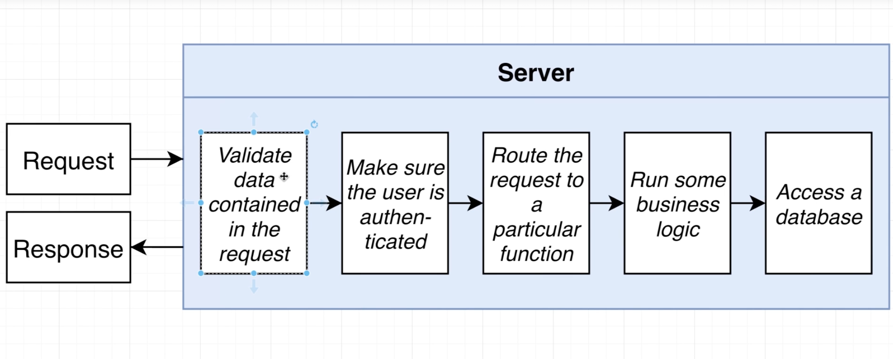
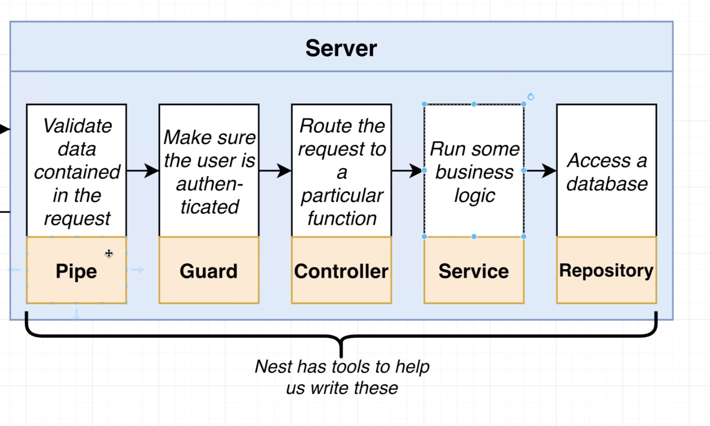
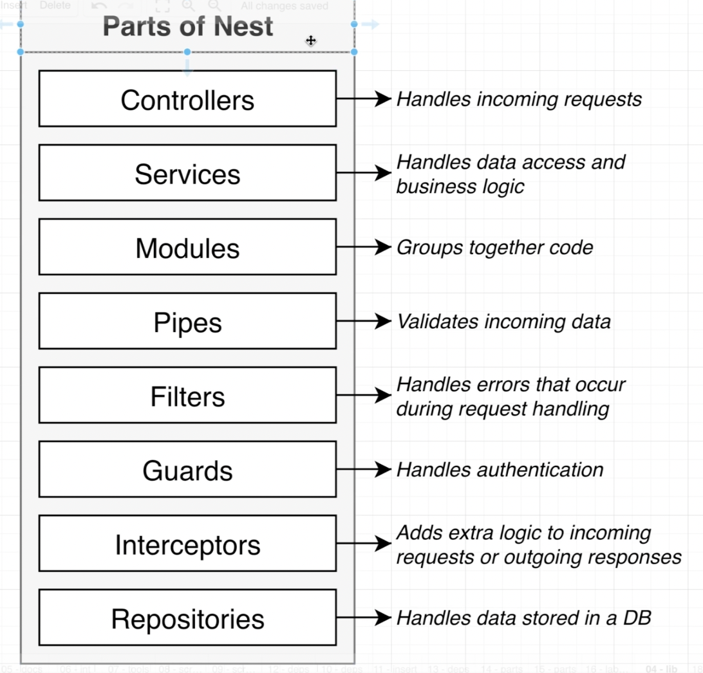
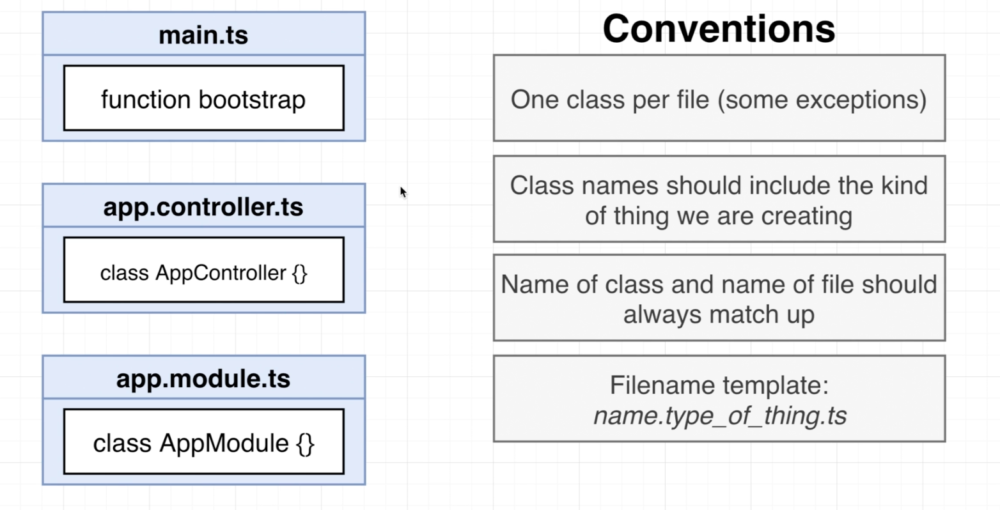
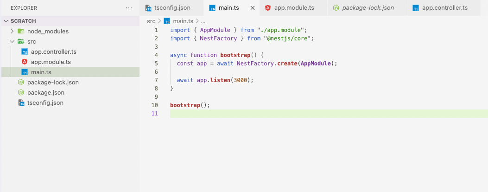

# 1. Install Packages

### Packages

```json
npm install @nestjs/common@7.6.17 @nestjs/core@7.6.17 @nestjs/platform-express@7.6.17 reflect-metadata@0.1.13 typescript@4.3.2
```

- @nestjs/common
- @nestjs/core
- @nestjs/platform-express
- @reflect-metadata
- typescript

### Package.json

```json
{
  "name": "scratch",
  "version": "1.0.0",
  "description": "",
  "main": "index.js",
  "scripts": {
    "test": "echo \"Error: no test specified\" && exit 1"
  },
  "keywords": [],
  "author": "",
  "license": "ISC",
  "dependencies": {
    "@nestjs/common": "^8.2.6",
    "@nestjs/core": "^8.2.6",
    "@nestjs/platform-express": "^8.2.6",
    "reflect-metadata": "^0.1.13",
    "typescript": "^4.3.2"
  }
}
```

### Packages Explained

- @nestjs/common
  - Contains vast majority of functions, classes, etc, that we need from Nest.
- @nestjs/platform-express
  - Lets Nest use Express JS for handling HTTP requests.
- reflect-metadata
  - Helps make decorators work.
- typescript
  - We write Nest apps with Typescript.

# 2. Set up Typescript compiler settings

### Create `tsconfig.json`

```json
{
  "compilerOptions": {
    "module": "commonjs",
    "target": "es2017",
    "experimentalDecorators": true,
    "emitDecoratorMetadata": true
  }
}
```

# 3. Create a Nest module and controller

### How Servers work





### Parts of Nest



### Basic Setup

```tsx
import { Controller, Module, Get } from "@nestjs/common";
import { NestFactory } from "@nestjs/core";

@Controller()
class AppController {
  @Get()
  getRootRoute() {
    return "hi there!";
  }
}

@Module({
  controllers: [AppController],
})
class AppModule {}

async function bootstrap() {
  const app = await NestFactory.create(AppModule);

  await app.listen(3000);
}

bootstrap();
```

### start

```bash
npx ts-node-dev src/main.ts
```

# 4. File Name Convention



### Convention Applied



### app.controller.ts

```tsx
import { Controller, Get } from "@nestjs/common";

@Controller()
export class AppController {
  @Get()
  getRootRoute() {
    return "hi there!";
  }
}
```

### app.module.ts

```tsx
import { Module } from "@nestjs/common";
import { AppController } from "./app.controller";

@Module({
  controllers: [AppController],
})
export class AppModule {}
```

### main.ts

```tsx
import { AppModule } from "./app.module";
import { NestFactory } from "@nestjs/core";

async function bootstrap() {
  const app = await NestFactory.create(AppModule);

  await app.listen(3000);
}

bootstrap();
```

# 5. Advanced Decorators (Routing)

```tsx
import { Controller, Get } from "@nestjs/common";

@Controller("/app")
export class AppController {
  @Get("/asdf")
  getRootRoute() {
    return "hi there!";
  }

  @Get("/bye")
  getByeThere() {
    return "bye there";
  }
}
```
